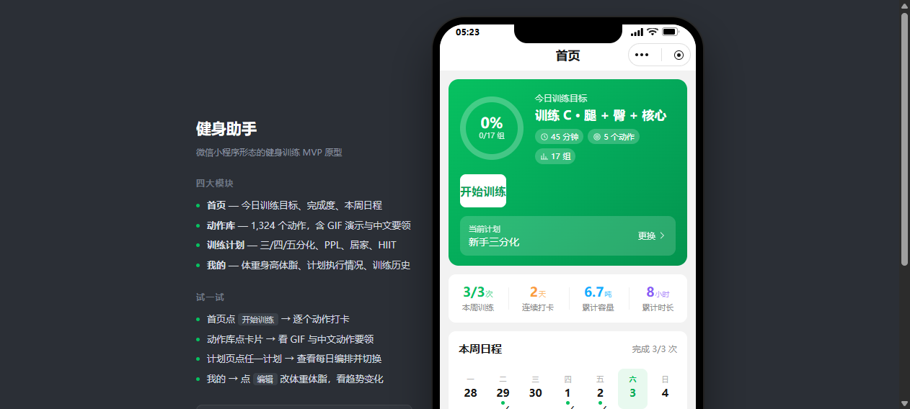
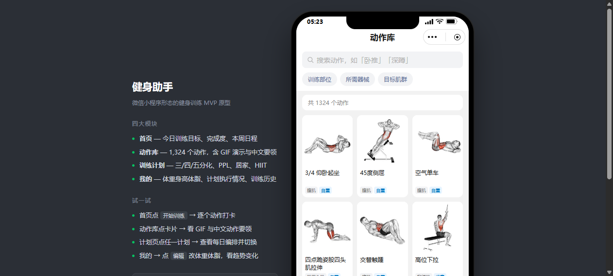
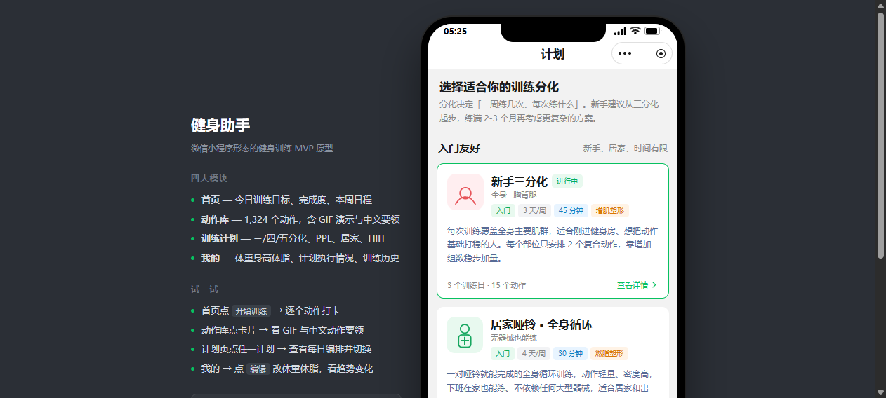
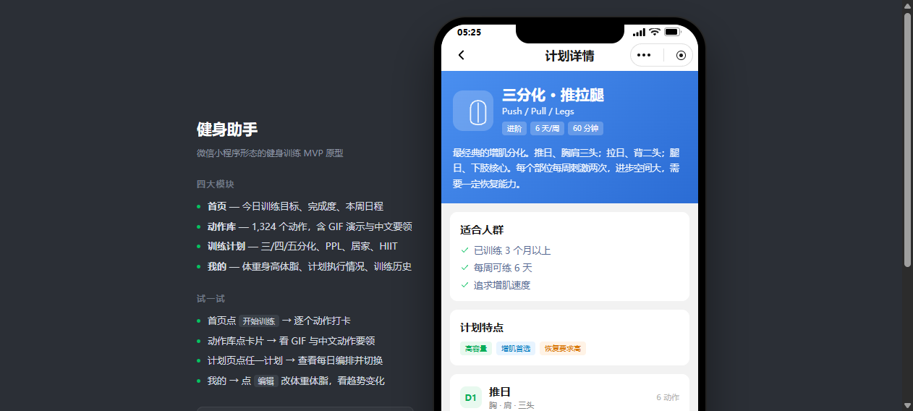
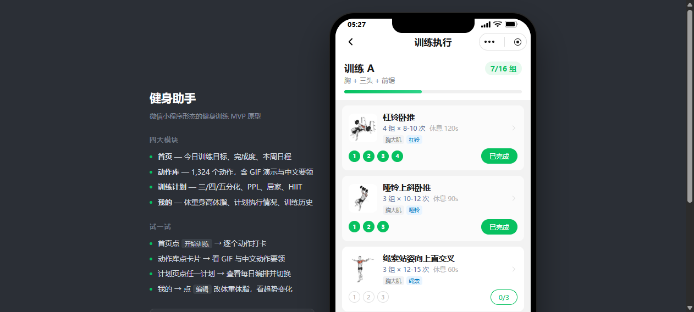
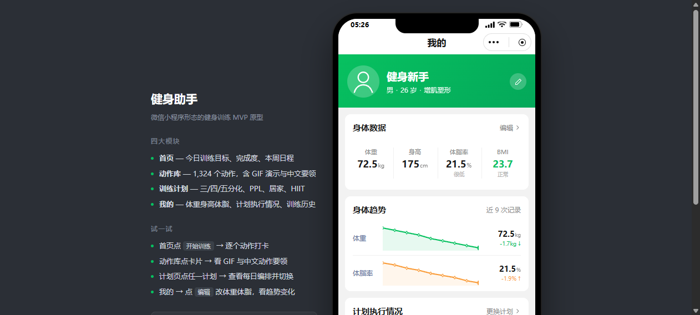
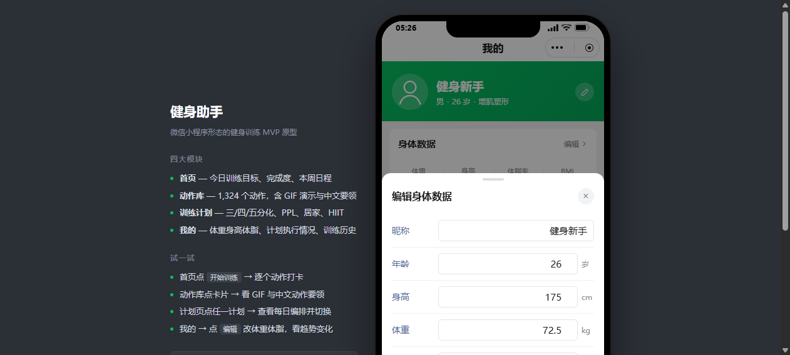

# 健身助手 · 微信小程序形态 MVP

> **🌐 在线体验：https://n0rth.asia**

一个健身训练应用的**可交互原型**，用纯 HTML/CSS/JS 模拟微信小程序，
包含完整的「计划 → 执行 → 数据回流」主链路。



---

## 快速开始

由于页面用 `<script src>` 加载 919KB 的动作数据（不用 fetch，避免 file:// 跨域），
**直接双击 `index.html` 就能打开**，无需任何构建或依赖。

如需本地服务：

```bash
python -m http.server 8848
# 打开 http://127.0.0.1:8848/index.html
```

> 动作图片与 GIF 走 jsDelivr CDN，**首次浏览需要联网**。
> 断网时会自动降级为占位图，不影响任何交互。

---

## 四大模块

| 模块 | 回答的问题 | 核心内容 |
|---|---|---|
| **首页** | 今天练什么 | 今日目标卡（环形进度）、本周日程、今日动作清单、四个数据格 |
| **动作库** | 这个动作怎么做 | 1,324 个动作，中文搜索 + 部位/器械/肌群筛选，GIF 演示 + 中文要领 |
| **训练计划** | 我该怎么练 | 6 套方案（新手三分化 / PPL / 上下肢四分化 / 五分化 / 居家 / HIIT） |
| **我的** | 我有什么变化 | 体重身高体脂 BMI、体重体脂趋势、计划执行率、训练历史 |

<p align="center">
  
  
  
</p>

<p align="center">
  
  
  
</p>

### 训练执行闭环

<p align="center"></p>

在训练页逐组打勾 → 进度条实时更新 → 完成后写入训练记录 →
自动回流到「我的」的周完成率、连续打卡、累计容量、部位分布。

---

## 目录结构

```
Fitness_APP/
├── index.html                    # 小程序外壳（状态栏/胶囊/导航栏/TabBar）
├── assets/
│   ├── css/
│   │   ├── app.css               # 微信视觉规范
│   │   └── pages.css             # 四大模块页面样式
│   └── js/
│       ├── data/
│       │   ├── exercises-data.js # 1324 个动作（生成，919 KB）
│       │   └── plans-data.js     # 6 套计划（生成，8 KB）
│       ├── store.js              # 状态 + localStorage 持久化 + 统计
│       ├── ui.js                 # hyperscript / Toast / 环形进度 / 折线图
│       ├── app.js                # 页面栈路由
│       └── pages/                # home / exercises / plans / workout / profile
├── tools/
│   ├── build_data.py             # 动作数据清洗 + 中文译名管线
│   └── build_plans.py            # 计划编排关联真实动作 id
├── docs/
│   ├── MVP设计文档.md             # 完整产品设计文档
│   └── screenshots/
└── data/exercises.json           # 原始开源数据集（17 MB）
```

---

## 数据来源

动作数据来自开源项目
[hasaneyldrm/exercises-dataset](https://github.com/hasaneyldrm/exercises-dataset)
（MIT License，1,324 个动作，含 10 种语言说明与 GIF 演示）。

**中文本地化**：数据集的中文说明覆盖 100%（1,324/1,324）。
动作原名为英文，项目内建了「多词短语优先 → 单词兜底 → 退化回退」三段式译名管线，
**1,321 条（99.8%）**已译为中文，仅 3 条极冷门体操动作回退为通用名称。

重新生成数据：

```bash
python tools/build_data.py    # → assets/js/data/exercises-data.js
python tools/build_plans.py   # → assets/js/data/plans-data.js
```

> ⚠️ **商用提示**：数据集代码与字段结构为 MIT，但 1,324 张图片和 GIF
> 版权归 **© Gym visual** 所有。正式商用前需自行取得媒体授权，
> 或替换为自有拍摄素材。本项目仅作技术验证与演示用途。

训练计划编排（组数、次数、组间休息、六套分化方案）为依据常规训练原则手工设计。

---

## 技术说明

- **零依赖、零构建** —— 原生 JS + IICE 模块，代码结构可平移到微信小程序真机
- **页面栈模拟** —— `navigateTo` / `switchTab` / `navigateBack`，280ms 推入动画
- **微信视觉还原** —— 状态栏、胶囊按钮、刘海、Home Indicator、主色 `#07C160`
- **数据持久化** —— localStorage，「我的 → 重置演示数据」可恢复初始状态

完整的产品定位、信息架构、数据模型与技术方案见 **[docs/MVP设计文档.md](docs/MVP设计文档.md)**。
